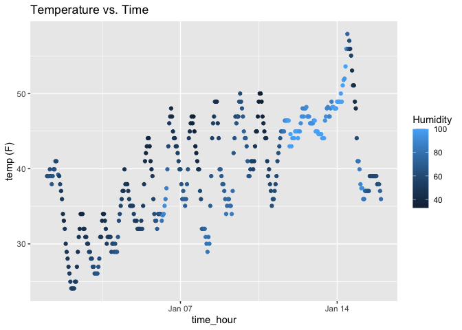

p8105_hw1_kw3180
================
Kino Watanabe
2025-09-18

# Problem 1

``` r
library(moderndive)
library(tidyverse)
```

## Importing and looking at data set

``` r
data("early_january_weather")
```

- There are 358 rows and 15 columns. The variables in the dataset are:
  origin, year, month, day, hour, temp (range: 24.08, 57.92), dewp
  (range: 8.96, 53.06), humid (range: 32.06, 100), wind_dir (range: 0,
  360), wind_speed (range: 0, 24.16638), wind_gust (range: 16.11092,
  31.07106), precip (range: 0, 0.19), pressure (range: 1010.8, 1034.4),
  visib (range: 0.12, 10), and time_hour (range: 2013-01-01 01:00:00,
  2013-01-15 23:00:00). The mean of the temperature is 39.5821229.

## Scatterplot

``` r
ggplot(early_january_weather, aes(x = time_hour, y = temp, color = humid)) + geom_point() +
    labs(
    title = "Temperature vs. Time",
    x = "time_hour",
    y = "temp (F)",
    color = "Humidity"
  )
```

<!-- -->

``` r
ggsave("scatter_plot.pdf", height = 4, width = 6)
```

- The temperature fluctuated throughout the day, but there is an upward
  trend in general through the month. As time passed in January, the
  temperature increased. The humidity seemed to increase throughout the
  month as well.

# Problem 2

## Create a dataframe

``` r
set.seed(1234)

p2_df = tibble(
  norm_samp = rnorm(10),
  vec_char = letters[1:10],
  vec_logical = rnorm(10) > 0,
  factor_vec = factor(rep(c("level1","level2","level3"), length.out = 10),
        levels = c("level1","level2","level3"))
)

p2_df
```

    ## # A tibble: 10 × 4
    ##    norm_samp vec_char vec_logical factor_vec
    ##        <dbl> <chr>    <lgl>       <fct>     
    ##  1    -1.21  a        FALSE       level1    
    ##  2     0.277 b        FALSE       level2    
    ##  3     1.08  c        FALSE       level3    
    ##  4    -2.35  d        TRUE        level1    
    ##  5     0.429 e        TRUE        level2    
    ##  6     0.506 f        FALSE       level3    
    ##  7    -0.575 g        FALSE       level1    
    ##  8    -0.547 h        FALSE       level2    
    ##  9    -0.564 i        FALSE       level3    
    ## 10    -0.890 j        TRUE        level1

## Creating means

``` r
mean(pull(p2_df, norm_samp))
```

    ## [1] -0.3831574

``` r
mean(pull(p2_df, vec_char))
```

    ## Warning in mean.default(pull(p2_df, vec_char)): argument is not numeric or
    ## logical: returning NA

    ## [1] NA

``` r
mean(pull(p2_df, vec_logical))
```

    ## [1] 0.3

``` r
mean(pull(p2_df, factor_vec))
```

    ## Warning in mean.default(pull(p2_df, factor_vec)): argument is not numeric or
    ## logical: returning NA

    ## [1] NA

- We can find the mean of the random sample of size 10 from a standard
  normal distribution (mean = -0.3831574) and a logical vector
  indicating whether elements of the sample are greater than 0 (mean =
  0.3). We can’t find the mean for a character vector of length 10 and a
  factor vector of length 10, with 3 different factor “levels.”

## Using as.numeric

``` r
as.numeric(pull(p2_df, vec_char))
as.numeric(pull(p2_df, vec_logical))
as.numeric(pull(p2_df, factor_vec))
```

- We can find the mean of the a logical vector indicating whether
  elements of the sample are greater than 0 because R converted “True”
  and “False” as binary “1” and “0,” respectively. Converting the
  logical vector into a binary number enabled us to find the mean. This
  helps explain why we can find the mean of T/F logical vectors.

- We couldn’t find the mean for a character vector of length 10 because
  it is a character variable. When we try to convert it as a numeric
  variable with as.numeric, R cannot process it and returns “NA.” This
  helps explain why we can’t find the mean of the character vectors.

- When we try to find the mean for a factor vector of length 10, with 3
  different factor “levels,” we cannot do it because it is a ordinal
  categorical variable. Despite this, the as.numeric function gives the
  levels as integer codes (in order of the respective levels). This may
  be confusing, but the as.numeric warning helps explain the
  discrepancy: as.numeric will return the underlying numeric (integer)
  representation. Even if we took the mean for these factors, it would
  be meaningless because the numbers are arbitrary labels.
